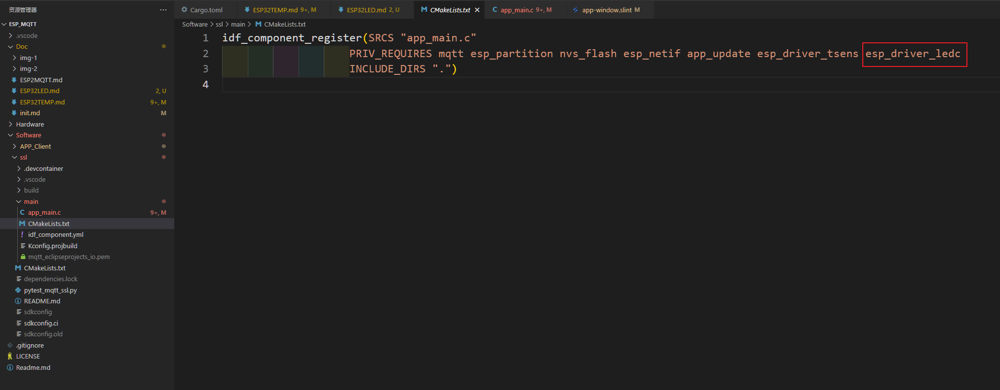
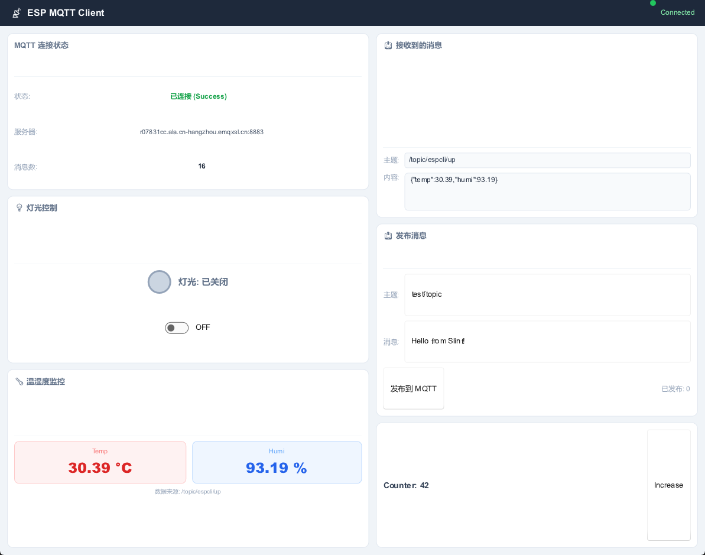

# ESP32 LED 驱动与客户端交互

> 本文档介绍如何在 ESP32 上使用 LEDC 驱动实现 PWM 调光、通过 JSON 格式进行 MQTT 数据收发，以及与其他客户端的交互方式。

---

## 📋 目录

- [ESP32 LED 驱动与客户端交互](#esp32-led-驱动与客户端交互)
  - [📋 目录](#-目录)
  - [💡 ESP32 增加 LED 驱动](#-esp32-增加-led-驱动)
    - [1. 添加组件依赖](#1-添加组件依赖)
    - [2. 编写驱动代码](#2-编写驱动代码)
  - [📦 JSON 格式的上报与下发](#-json-格式的上报与下发)
  - [🔗 主题的订阅与收发](#-主题的订阅与收发)
    - [主题分配](#主题分配)
    - [通信流程](#通信流程)
  - [✨ 效果展示](#-效果展示)
    - [客户端界面](#客户端界面)
  - [📚 参考资料](#-参考资料)

---

## 💡 ESP32 增加 LED 驱动

在 ESP-IDF 中添加官方的 **LEDC 驱动**，该驱动基于 PWM 原理实现 LED 灯的亮度调节。

### 1. 添加组件依赖

在工程的 [`CMakeLists.txt`](../Software/ssl/main/CMakeLists.txt) 中添加 `esp_driver_ledc` 组件：



### 2. 编写驱动代码

在 [`app_main.c`](../Software/ssl/main/app_main.c) 中添加 LED PWM 初始化代码：

```c
#include "driver/ledc.h"
// ...

/* 配置 LED PWM (LEDC) 用于 IO3 调光 */
ledc_timer_config_t ledc_timer = {
    .speed_mode       = LEDC_MODE,
    .timer_num        = LEDC_TIMER,
    .duty_resolution  = LEDC_DUTY_RES,
    .freq_hz          = LEDC_FREQUENCY,
    .clk_cfg          = LEDC_AUTO_CLK,
};
ledc_timer_config(&ledc_timer);

ledc_channel_config_t ledc_channel = {
    .speed_mode     = LEDC_MODE,
    .channel        = LEDC_CHANNEL,
    .timer_sel      = LEDC_TIMER,
    .gpio_num       = LED_GPIO_PIN,
    .duty           = LEDC_MAX_DUTY / 2,   /* 初始 50% 亮度 */
    .hpoint         = 0,
};
ledc_channel_config(&ledc_channel);

/* 安装 LEDC 渐变功能 */
ledc_fade_func_install(0);
ESP_LOGI(TAG, "LED on GPIO%d PWM initialized at 50%% brightness (fade enabled)", LED_GPIO_PIN);
```

> **💡 提示**：完整代码请参考项目仓库中的 [`app_main.c`](../Software/ssl/main/app_main.c) 文件。

---

## 📦 JSON 格式的上报与下发

JSON 是一种通用的数据交换格式，广泛用于 MQTT 消息的收发。项目中常用的 JSON 消息格式如下：

| 功能 | JSON 格式 | 说明 |
|:----:|:----------|:-----|
| LED 开关控制 | `{"light":x}` | `x` 为 `0`（关）或 `1`（开） |
| 温湿度上报 | `{"temp":%.2f,"humi":%.2f}` | 温度和湿度，保留两位小数 |

> **📚 参考**：详细的 JSON 操作可以参考 [cJSON 库](https://github.com/DaveGamble/cJSON)。

---

## 🔗 主题的订阅与收发

ESP32 与其他客户端的交互主要通过 MQTT 的 **主题订阅与推送** 实现。

### 主题分配

| 角色 | 订阅主题 | 发布主题 |
|:----:|:---------|:---------|
| **ESP32** | `/topic/appcli/up` | `/topic/espcli/up` |
| **其他客户端** | `/topic/espcli/up` | `/topic/appcli/up` |

### 通信流程

```
┌─────────────┐    MQTT Broker    ┌─────────────────┐
│    ESP32     │◄────────────────►│  其他客户端      │
│              │  /topic/appcli/up │  (手机 APP 等)  │
│  温湿度采集  │  /topic/espcli/up │  数据显示 & 控制 │
└─────────────┘                   └─────────────────┘
```

> **📝 说明**：其他客户端的开发方式与 ESP32 类似，可以使用 AI 生成一个对应的客户端应用即可。

---

## ✨ 效果展示

### 客户端界面



客户端功能包括：

- ✅ **订阅** ESP32 发布的主题，接收温湿度数据并解析显示
- ✅ 通过**按键控制** ESP32 的 LED 亮灭

---

## 📚 参考资料

- [ESP-IDF LEDC 驱动文档](https://docs.espressif.com/projects/esp-idf/zh_CN/latest/esp32/api-reference/peripherals/ledc.html)
- [cJSON 库](https://github.com/DaveGamble/cJSON)
- [MQTT 协议规范](https://mqtt.org/)
