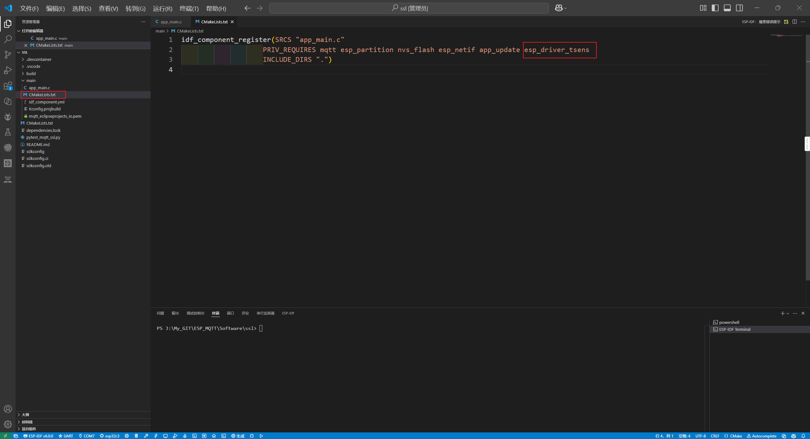
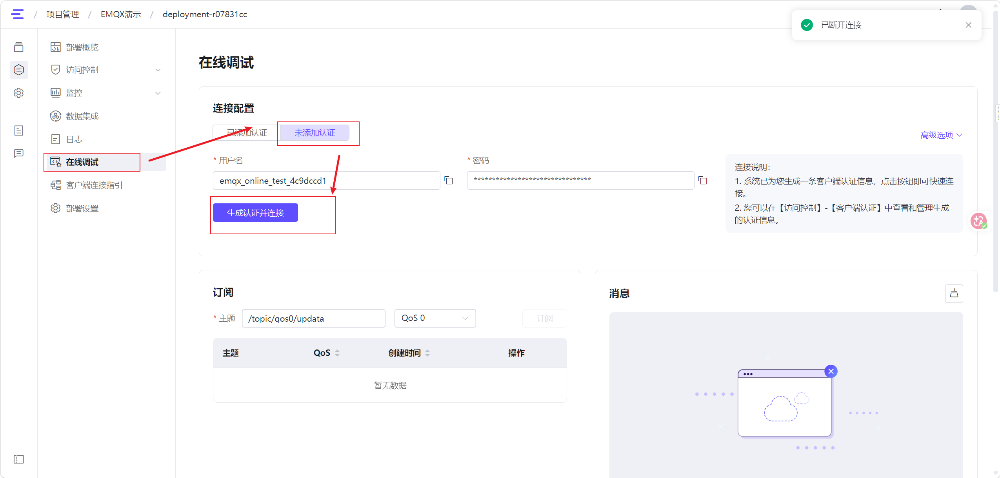
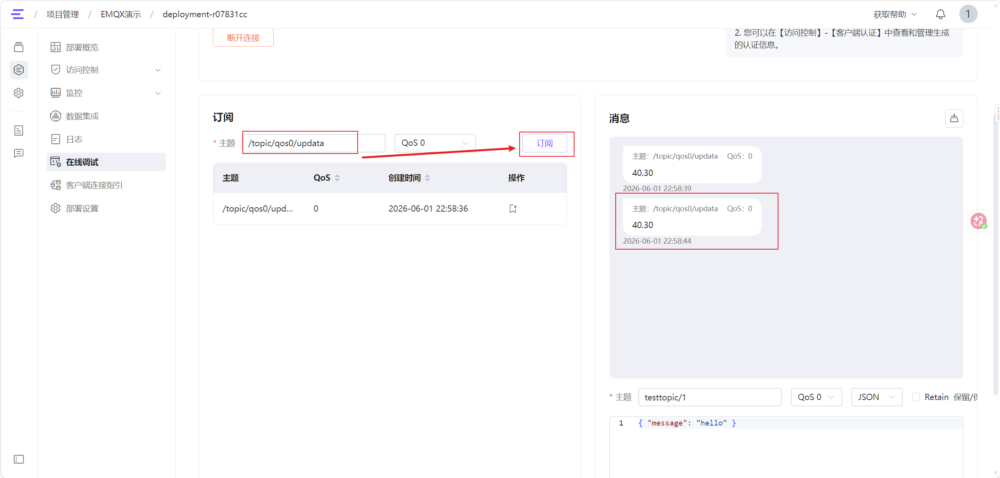
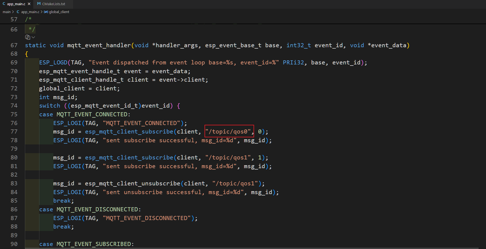
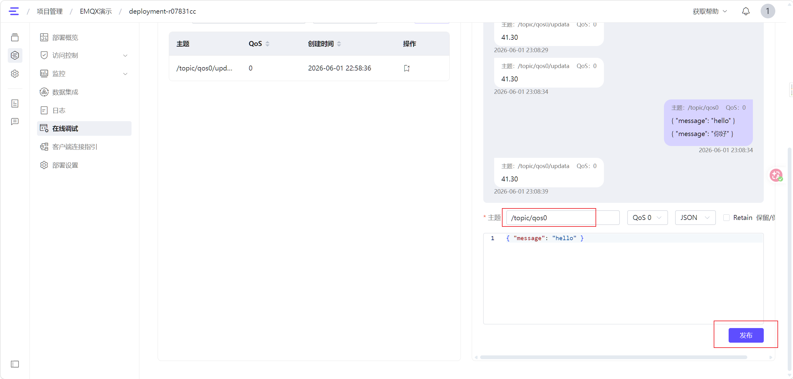
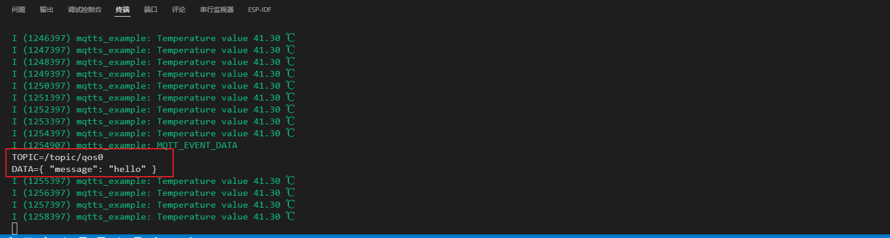

# ESP32 上报芯片温度到 EMQX 平台

> 本文档介绍如何使用 ESP32 内置温度传感器采集芯片温度，并通过 MQTT 协议上报至 EMQX 平台，同时实现双向通信。此外还介绍了如何外接 AHT10 温湿度传感器采集环境数据并上报。

---

## 📋 目录

- [ESP32 上报芯片温度到 EMQX 平台](#esp32-上报芯片温度到-emqx-平台)
  - [📋 目录](#-目录)
  - [🌡️ 获取芯片温度并且上报](#️-获取芯片温度并且上报)
    - [1. 配置项目](#1-配置项目)
    - [2. 修改代码](#2-修改代码)
    - [3. 验证数据](#3-验证数据)
  - [📨 ESP32 订阅其他客户端发送的数据](#-esp32-订阅其他客户端发送的数据)
  - [🔌 外接 AHT10 上报温湿度](#-外接-aht10-上报温湿度)
    - [1. 硬件接线](#1-硬件接线)
    - [2. 添加 AHT 组件依赖](#2-添加-aht-组件依赖)
    - [3. 初始化 I2C 总线](#3-初始化-i2c-总线)
    - [4. 编写 AHT10 采集任务](#4-编写-aht10-采集任务)
      - [代码说明](#代码说明)
    - [5. 创建任务并启动](#5-创建任务并启动)
    - [6. 验证数据](#6-验证数据)
  - [📚 参考资料](#-参考资料)

---

## 🌡️ 获取芯片温度并且上报

创建 ESP32 的温度传感器，并且获取芯片温度。

### 1. 配置项目

在工程的 `main` 文件夹 [`CMakeLists.txt`](../Software/ssl/main/CMakeLists.txt) 中添加组件 `esp_driver_tsens`：



---

### 2. 修改代码

在 [`app_main.c`](../Software/ssl/main/app_main.c) 文件中修改代码，以正常使用芯片内部的温度传感器：

```c
esp_mqtt_client_handle_t global_client; // 完整代码请参考 github 项目文件相关部分

void temp_task(void *p) {
    ESP_LOGI(TAG, "Install temperature sensor, expected temp range: 10~50 ℃");
    temperature_sensor_handle_t temp_sensor = NULL;
    temperature_sensor_config_t temp_sensor_config = TEMPERATURE_SENSOR_CONFIG_DEFAULT(10, 50);
    ESP_ERROR_CHECK(temperature_sensor_install(&temp_sensor_config, &temp_sensor));

    ESP_LOGI(TAG, "Enable temperature sensor");
    ESP_ERROR_CHECK(temperature_sensor_enable(temp_sensor));

    float tsens_value;
    int count = 0;
    while (1) {
        ESP_ERROR_CHECK(temperature_sensor_get_celsius(temp_sensor, &tsens_value));
        ESP_LOGI(TAG, "Temperature value %.02f ℃", tsens_value);
        vTaskDelay(pdMS_TO_TICKS(1000));
        count++;
        if (count == 5) {
            char buf[20];
            sprintf(buf, "%.02f", tsens_value);
            esp_mqtt_client_publish(global_client, "/topic/qos0/updata", buf, 0, 0, 0);
            count = 0;
        }
    }
}
```

> **📝 说明**：每隔 5 秒（每秒采集一次，第 5 次时上报）将温度数据通过 MQTT 发布到 `/topic/qos0/updata` 主题。

---

### 3. 验证数据

编译烧录后，在 EMQX 后台可以查看 ESP32 上报的数据：



连接后点击 **订阅**，即可实时查看 ESP32 上报的温度数据：



---

## 📨 ESP32 订阅其他客户端发送的数据

这部分的代码在 ESP32 的例程里面已经存在了，所以只需要在后台的在线调试发送数据到 ESP32 订阅的主题即可。

**ESP32 订阅的主题：**



**在后台的在线调试向 ESP32 订阅的主题发送数据：**



**在 ESP32 调试日志中查看后台发送的数据：**



---

## 🔌 外接 AHT10 上报温湿度

> [AHT10](https://github.com/esp-idf-lib/esp-idf-lib) 是一款数字温湿度传感器，通过 I2C 接口与 ESP32 通信。本节介绍如何使用 [`esp-idf-lib/aht`](https://github.com/esp-idf-lib/esp-idf-lib) 组件驱动 AHT10，并将温湿度数据通过 MQTT 上报至 EMQX 平台。

### 1. 硬件接线

AHT10 通过 I2C 与 ESP32-C3 连接，接线方式如下：

| AHT10 引脚 | ESP32-C3 引脚 | 说明 |
|:-----------:|:-------------:|:-----|
| VCC         | 3.3V          | 供电 |
| GND         | GND           | 接地 |
| SDA         | GPIO_5        | I2C 数据线 |
| SCL         | GPIO_6        | I2C 时钟线 |

> **⚠️ 注意**：ESP32-C3 的 `GPIO_6` ~ `GPIO_11` 被 SPI Flash 占用，请根据实际模组确认是否可用。如果不可用，请选择其他安全引脚（如 `GPIO_2`、`GPIO_3`、`GPIO_4`、`GPIO_18`、`GPIO_19`）。

---

### 2. 添加 AHT 组件依赖

在工程的 [`idf_component.yml`](../Software/ssl/main/idf_component.yml) 文件中添加 `esp-idf-lib/aht` 依赖：

```yaml
dependencies:
  protocol_examples_common:
    path: ${IDF_PATH}/examples/common_components/protocol_examples_common
  esp-idf-lib/aht: ^1.0.8
```

> **💡 提示**：[`esp-idf-lib/aht`](https://components.espressif.com/components/esp-idf-lib/aht) 组件会自动拉取 `i2cdev` 和 `esp_idf_lib_helpers` 等依赖，无需手动添加。

---

### 3. 初始化 I2C 总线

在 [`app_main()`](../Software/ssl/main/app_main.c:273) 中调用 [`i2cdev_init()`](../Software/ssl/main/app_main.c:298) 初始化 esp-idf-lib 的 I2C 设备驱动框架（该函数是使用所有 esp-idf-lib I2C 设备的前提）：

```c
/* 初始化 i2cdev 库（esp-idf-lib 的 I2C 设备驱动必须先调用此函数） */
esp_err_t i2c_ret = i2cdev_init();
if (i2c_ret != ESP_OK) {
    ESP_LOGW(TAG, "i2cdev_init: %s (may already be initialized)", esp_err_to_name(i2c_ret));
}
```

---

### 4. 编写 AHT10 采集任务

在 [`app_main.c`](../Software/ssl/main/app_main.c:200) 中创建 AHT10 采集任务 [`aht10_task()`](../Software/ssl/main/app_main.c:211)，核心逻辑如下：

```c
/* ======================== AHT10 Task (使用 esp-idf-lib/aht 组件) ======================== */

#define AHT10_I2C_PORT      I2C_NUM_0
#define AHT10_SDA_PIN       GPIO_NUM_5
#define AHT10_SCL_PIN       GPIO_NUM_6

void aht10_task(void *p)
{
    aht_t dev = { 0 };
    dev.type = AHT_TYPE_AHT1x;
    dev.mode = AHT_MODE_NORMAL;

    /* 初始化 AHT10 I2C 描述符 */
    esp_err_t ret = aht_init_desc(&dev, AHT_I2C_ADDRESS_GND, AHT10_I2C_PORT, AHT10_SDA_PIN, AHT10_SCL_PIN);
    if (ret != ESP_OK) {
        ESP_LOGE(TAG, "aht_init_desc failed: %s", esp_err_to_name(ret));
        vTaskDelete(NULL);
        return;
    }

    /* 等待 AHT10 上电稳定（数据手册要求至少 20ms，实际建议 300ms+） */
    vTaskDelay(pdMS_TO_TICKS(500));

    /* 初始化传感器（带重试，AHT10 首次通信可能失败） */
    bool init_ok = false;
    for (int retry = 0; retry < 5; retry++) {
        ret = aht_init(&dev);
        if (ret == ESP_OK) {
            init_ok = true;
            break;
        }
        ESP_LOGW(TAG, "aht_init attempt %d failed: %s, retrying...", retry + 1, esp_err_to_name(ret));
        vTaskDelay(pdMS_TO_TICKS(200));
    }

    if (!init_ok) {
        ESP_LOGW(TAG, "aht_init failed after retries, will try to read anyway");
    }

    /* 检查校准状态 */
    bool busy = false, calibrated = false;
    ret = aht_get_status(&dev, &busy, &calibrated);
    if (ret == ESP_OK) {
        ESP_LOGI(TAG, "AHT10 status: busy=%d, calibrated=%s", busy, calibrated ? "yes" : "no");
    }

    ESP_LOGI(TAG, "AHT10 initialized successfully");

    float temperature, humidity;
    int count = 0;
    while (1) {
        ret = aht_get_data(&dev, &temperature, &humidity);
        if (ret == ESP_OK) {
            ESP_LOGI(TAG, "AHT10 -> Temp: %.2f ℃, Humidity: %.2f %%RH", temperature, humidity);
            count++;
            if (count >= 5) {
                char buf[64];
                snprintf(buf, sizeof(buf), "{\"temp\":%.2f,\"humi\":%.2f}", temperature, humidity);
                esp_mqtt_client_publish(global_client, "/topic/qos0/aht10", buf, 0, 0, 0);
                count = 0;
            }
        } else {
            ESP_LOGE(TAG, "AHT10 read failed: %s", esp_err_to_name(ret));
        }
        vTaskDelay(pdMS_TO_TICKS(2000));
    }
}
```

#### 代码说明

| 步骤 | 说明 |
|:----:|:-----|
| 初始化 I2C 描述符 | 调用 [`aht_init_desc()`](../Software/ssl/main/app_main.c:218) 指定 I2C 地址（`AHT_I2C_ADDRESS_GND`，即 `0x38`）、端口号和 SDA/SCL 引脚 |
| 等待上电稳定 | AHT10 数据手册要求上电后至少等待 20ms，这里等待 500ms 确保稳定 |
| 初始化传感器 | 调用 [`aht_init()`](../Software/ssl/main/app_main.c:231) 发送初始化命令，最多重试 5 次 |
| 检查校准状态 | 调用 [`aht_get_status()`](../Software/ssl/main/app_main.c:246) 确认传感器是否已校准 |
| 循环采集数据 | 每 2 秒采集一次温湿度，每 5 次（约 10 秒）通过 MQTT 上报一次 |
| MQTT 上报格式 | JSON 格式 `{"temp":温度,"humi":湿度}`，发布到主题 `/topic/qos0/aht10` |

---

### 5. 创建任务并启动

在 [`app_main()`](../Software/ssl/main/app_main.c:273) 末尾创建 [`aht10_task`](../Software/ssl/main/app_main.c:327) 任务：

```c
xTaskCreate(aht10_task, "aht10_task", 4096, NULL, 5, NULL);
```

> **📝 说明**：AHT10 任务栈大小设为 4096 字节（比芯片温度任务的 2048 字节更大），因为 I2C 通信需要更多栈空间。

---

### 6. 验证数据

编译烧录后，可以在 ESP32 串口日志中看到 AHT10 采集的温湿度数据：

```
I (1234) mqtts_example: AHT10 -> Temp: 25.36 ℃, Humidity: 58.12 %RH
```

在 EMQX 后台订阅 `/topic/espcli/up` 主题，即可实时查看 ESP32 上报的温湿度 JSON 数据：

```json
{"temp":25.36,"humi":58.12}
```

---

## 📚 参考资料

- [ESP-IDF 温度传感器驱动](https://docs.espressif.com/projects/esp-idf/zh_CN/latest/esp32/api-reference/peripherals/temp_sensor.html)
- [esp-idf-lib/aht 组件](https://components.espressif.com/components/esp-idf-lib/aht)
- [AHT10 数据手册](http://www.aosong.com/products-21.html)
- [cJSON 库](https://github.com/DaveGamble/cJSON)
- [MQTT 协议规范](https://mqtt.org/)
