# ESP32的MQTT工程

## 项目介绍

## 1.创建EMQX免费版本
&emsp;&emsp;注意：不想创建账号可以跳转到第X步，可以直接使用免费的broker服务器。
### 1.1 访问 [EMQX官网](https://www.emqx.com/zh/try-free) 创建免费服务。
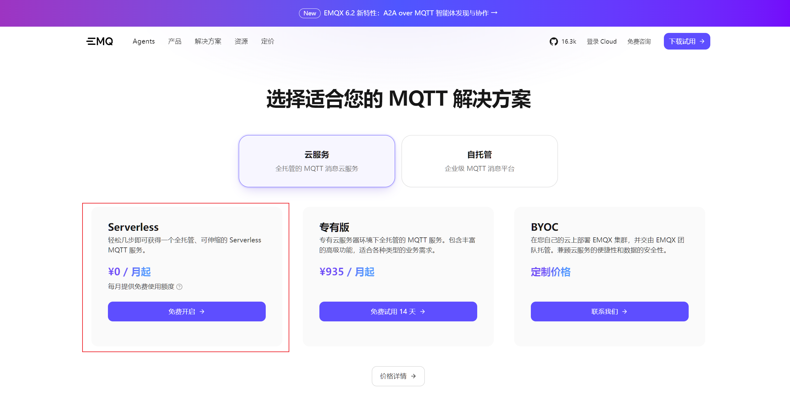
### 1.2 创建EMQX Broker
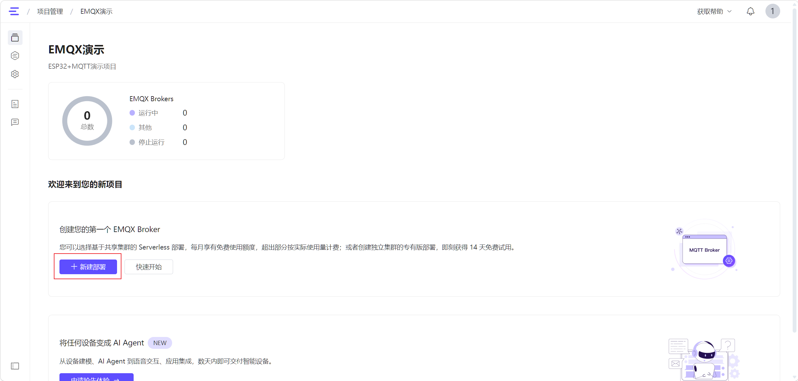
### 1.3 选择对应的版本：
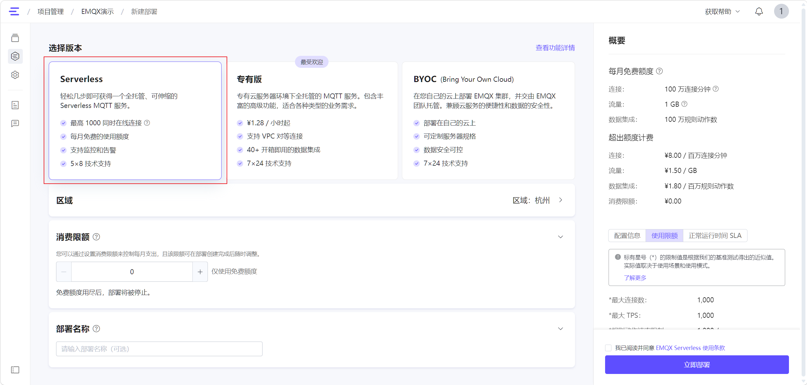
&emsp;&emsp;这个版本的可以支持23台设备连续连接一个月，足以满足学习测试用。
### 1.4 创建成功后进入已经部署的项目页面
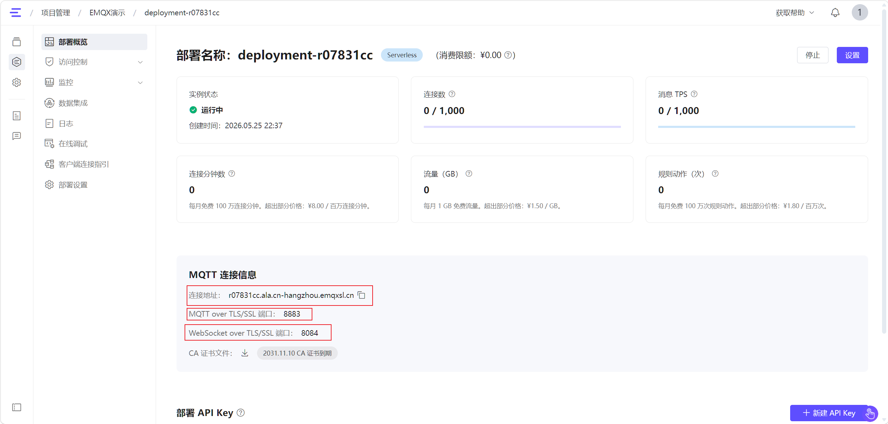
&emsp;&emsp;确认连接地址和端口号

## 2.创建ESP32工程
&emsp;&emsp;根据第一步创建的MQTT工程，在1.4的创建项目后有两个端口使用
我们使用8883端口，所以创建的工程使用TLS/SSL的例程。
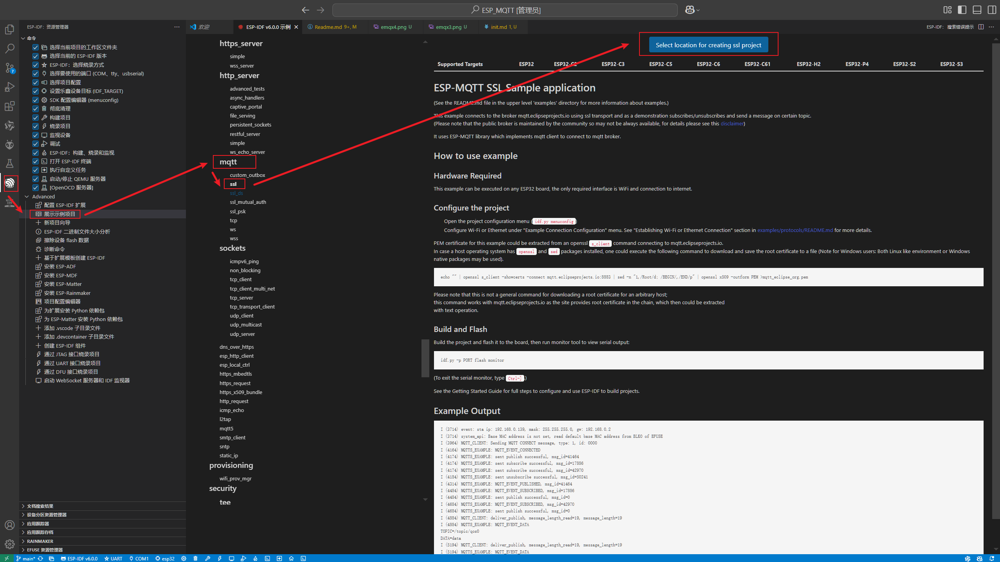
&emsp;&emsp;创建成功后会自动打开新窗口，打开ESP32的项目。创建成功后我们就可以开始使用ESP32连接MQTT了。

先配置串口和芯片型号；我是使用ESP32-C3，切换为对应版本，否则不能烧录运行。
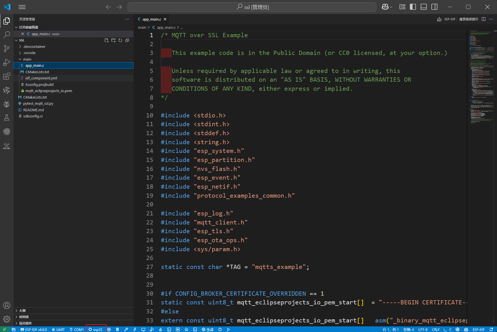

芯片设置修改完成后根据步骤进行项目配置修改：
修改mqtt地址，SSID名称（即WIFI名称），WIFI密码。
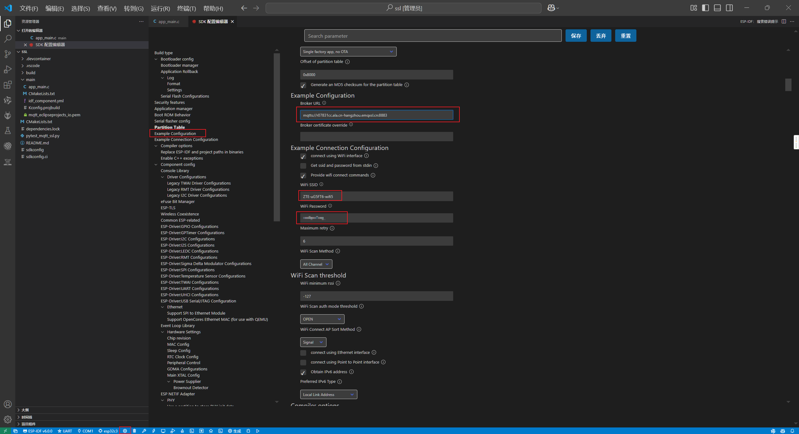
点击右上角的保存
注意，证书需要下载到本地，填入到证书文件中：
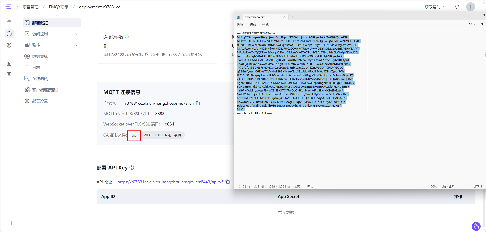
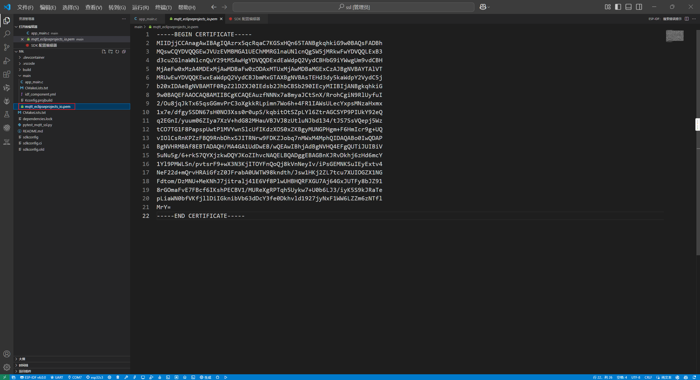
然后修改app_main的配置，完善mqtt认证配置
我这里填的用户名:esp_client
密码:12345678
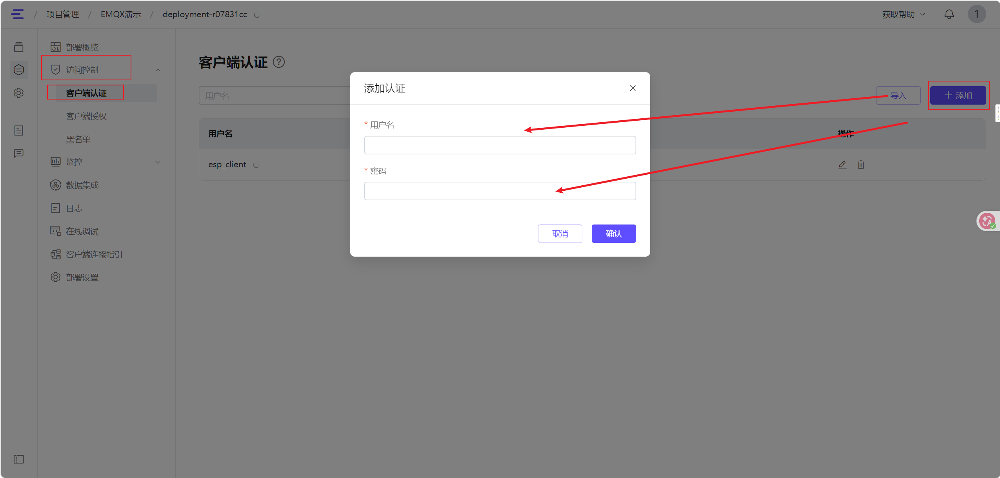

项目配置完成可以进行编译烧录了。
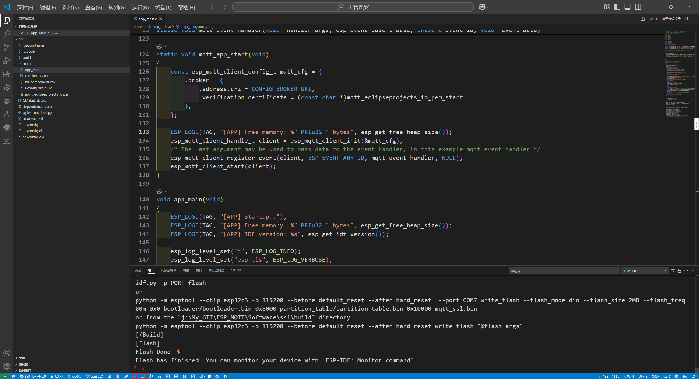

查看运行日志，ESP32已经连接上EMQX部署的项目了
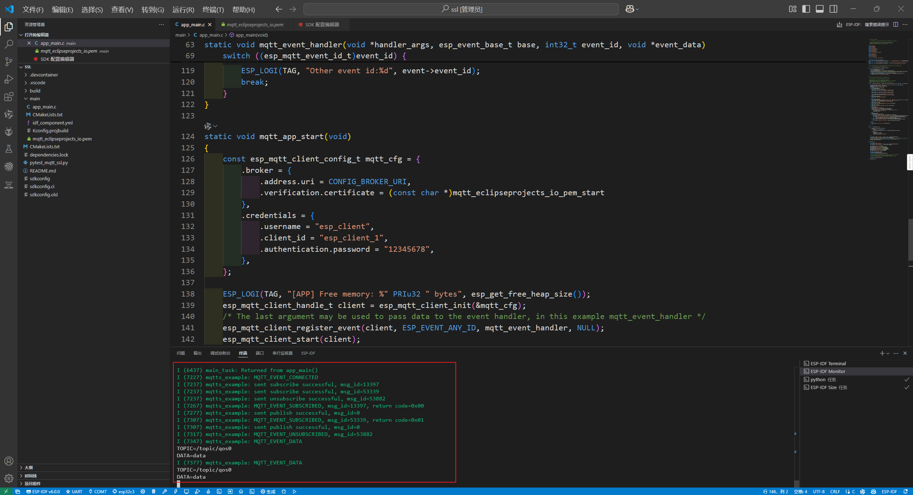
查看EMQX的后台也可以看到已经有设备连接上了。
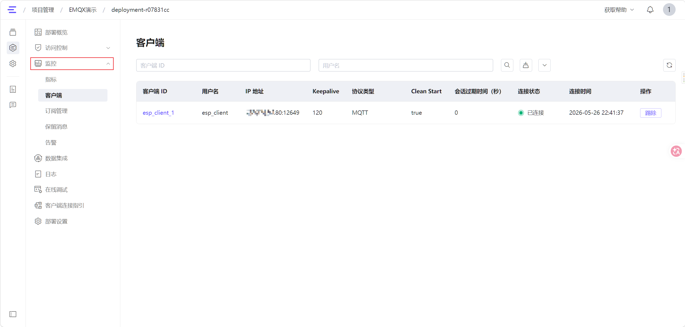