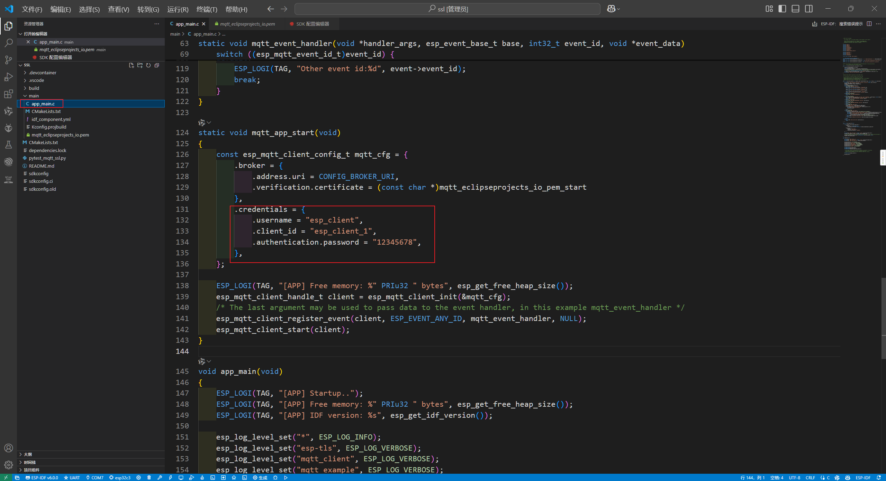

# ESP32 的 MQTT 工程

> 基于 ESP32 开发板与 EMQX 平台的 MQTT 通信教程，支持 TLS/SSL 安全连接。

---

## 📋 项目介绍

本项目演示如何使用 ESP32 开发板连接 EMQX MQTT 服务器，实现物联网设备的远程通信。

**相关文档：**

- [ESP-IDF 安装](Doc/init.md) — 开发环境安装说明
- [ESP32 MQTT 工程指南](Doc/ESP2MQTT.md) — 完整的图文教程
- [ESP32 上报芯片温度](Doc/ESP32TEMP.md) — 温度传感器数据上报示例

---

## 🚀 快速开始

### 1. 创建 EMQX 免费版本

> **💡 提示**：不想创建账号可以跳转到第 [2 步](#2-创建-esp32-工程)，直接使用免费的 broker 服务器。

#### 1.1 访问 EMQX 官网

访问 [EMQX 官网](https://www.emqx.com/zh/try-free) 创建免费服务。


#### 1.2 创建 EMQX Broker


#### 1.3 选择对应版本


> **📝 说明**：此版本支持 23 台设备连续连接一个月，足以满足学习测试需求。

#### 1.4 查看部署项目

创建成功后，进入已部署的项目页面。


确认连接地址和端口号。

---

### 2. 创建 ESP32 工程

根据第一步创建的 MQTT 工程，在 1.4 的创建项目后有两个端口可供使用。我们使用 **8883 端口**，因此创建的工程需要使用 TLS/SSL 的例程。


创建成功后会自动打开新窗口，加载 ESP32 的项目。此时我们就可以开始使用 ESP32 连接 MQTT 了。

#### 2.1 配置串口和芯片型号

> **⚠️ 注意**：请根据您的实际硬件选择对应的芯片型号，否则无法烧录运行。

本示例使用 **ESP32-C3**，请切换为对应版本。


#### 2.2 修改项目配置

芯片设置修改完成后，根据以下步骤进行项目配置修改：

1. 修改 MQTT 服务器地址
2. 修改 SSID 名称（即 WiFi 名称）
3. 修改 WiFi 密码


点击右上角的 **保存** 按钮。

#### 2.3 配置 SSL 证书

> **⚠️ 重要**：证书需要下载到本地，填入到证书文件中。


#### 2.4 配置 MQTT 认证

修改 `app_main` 的配置，完善 MQTT 认证信息。

**示例配置：**

- 用户名：`esp_client`
- 密码：`12345678`




---

### 3. 编译和烧录

项目配置完成后，即可进行编译和烧录。


---

### 4. 验证连接

#### 4.1 查看运行日志

查看运行日志，确认 ESP32 已成功连接上 EMQX 部署的项目。


#### 4.2 查看 EMQX 后台

登录 EMQX 后台，可以看到已有设备成功连接。


---

## 📁 项目结构

```text
ESP_MQTT/
├── Doc/                  # 项目文档
│   ├── ESP2MQTT.md       # MQTT 工程指南
│   ├── ESP32TEMP.md      # 温度上报教程
│   ├── init.md           # ESP-IDF 安装说明
│   ├── img-1/            # 文档图片素材 1
│   └── img-2/            # 文档图片素材 2
├── Hardware/             # 硬件相关资料
├── Software/             # 软件工程代码
│   └── ssl/              # TLS/SSL MQTT 示例工程
├── Readme.md             # 项目说明文档
└── LICENSE               # 开源许可证
```

---

## 📚 参考资料

- [EMQX 官方文档](https://docs.emqx.com/zh/)
- [ESP-IDF 编程指南](https://docs.espressif.com/projects/esp-idf/zh_CN/latest/esp32/)
- [MQTT 协议规范](https://mqtt.org/)

---

## 🤝 贡献

欢迎提交 Issue 和 Pull Request 来改进本项目。

---

## 📄 许可证

本项目采用 MIT 许可证，详见 [LICENSE](LICENSE)。
